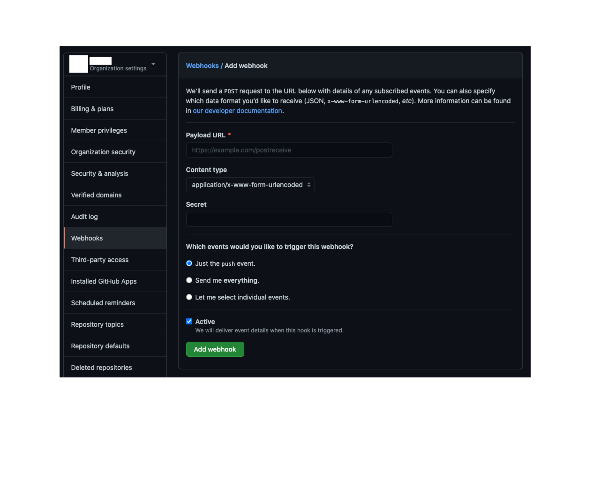

# GitHubとDiscordの連携

## 背景
- 所属する団体が主に使っている連絡サービスがDiscordだったので、GitHubとDiscordで連携をしてみることにしました.

## やりかた
1. まずはボットを配置するためのチャンネルを用意します. 
2. 用意したら、[``チャンネルの編集``]を選択して、その中にある[連携サービス]を選択. 
3. 連携サービスを選び表示された画面の中から [``ウェブフック``]を選び、新しいウェブフックを生成. このとき名前にはボットの名前を、チャンネルにはボットを配置するチャンネルを指定します. 
4. ウェブフックが作成できたらそのウェブフックのURLをコピーします.
5. GitHubのページにて設定を行います. GitHubでは``https://github.com/organizations/組織のアカウント名/settings/hooks``へ移動してください(組織のアカウント名には自身が通知をしてほしいアカウントの名前を選択します). 
6. それが完了したら[``Add webhook``]を選んで、各種設定を行います.(詳細は下の画像)
   1. Payload URL: DiscordにてコピーしたURLをペースト
   2. Content type: application/json を選択
   3. Which events would you like to trigger this web hook? : Discordに通知したい情報を選択
      1. Just the push event. -> push通知のみ
      2. Send me everything. -> GitHubのリポジトリの変更すべての通知
      3. Let me select individual events. -> 通知する項目を選択
7. 全てが済んだら[``Add webhook``]をクリックする.

以上の手順によってDiscordとGitHubの連携ができるようになる. 

